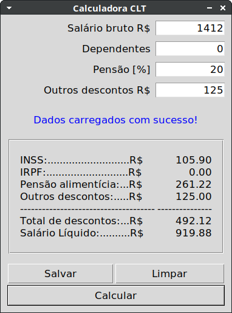
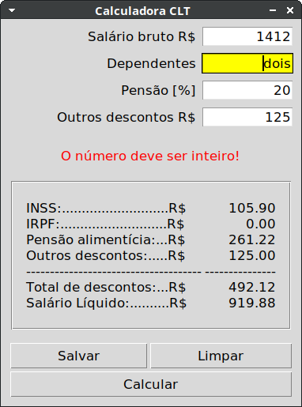
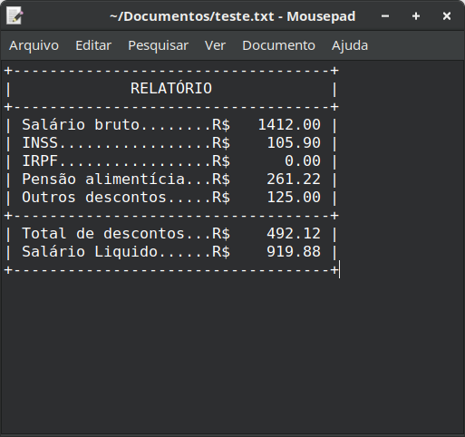
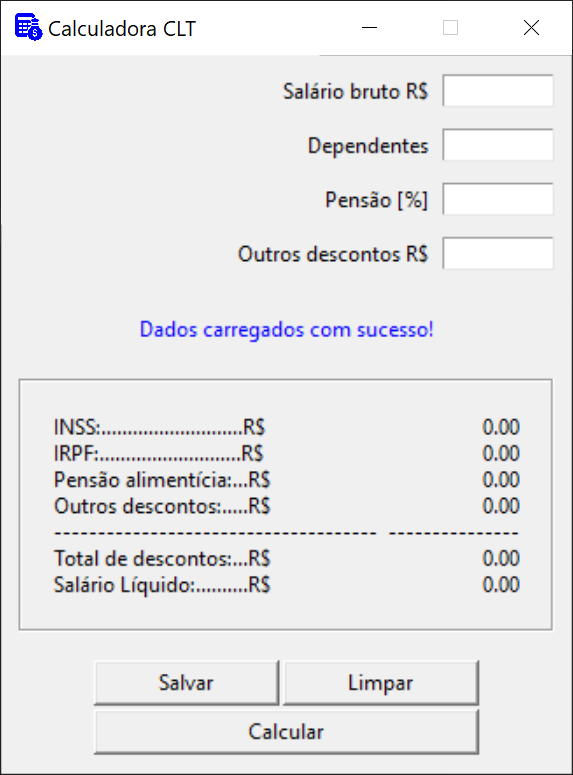

#  Calculadora Salário Líquido CLT

Simples calculadora para cálculo do salário líquido para trabalhadores em regime CLT.
Os valores para cálculo  de *[IRPF](https://www.gov.br/receitafederal/pt-br/assuntos/meu-imposto-de-renda/tabelas/2024)* e *[INSS](https://www.gov.br/inss/pt-br/direitos-e-deveres/inscricao-e-contribuicao/tabela-de-contribuicao-mensal)* são capturados **diretamente** do site do governo: *[www.gov.br](https://www.gov.br/pt-br)*.

 ---

## Funcionamento

1. Inserir dados do trabalhador e clicar em calcular.
   
   

2. A calculadora possui um sistema de validação de dados. Caso o usuário tenha escrito algo **errado** será avisado disso.
   
   

3. Caso o usuário quiser, é possível gerar um relatório em formato .txt clicando em salvar.
    

---

## Aparência do aplicativo no Windows



---

### Para criar um executável com pyinstaller:

No Windows:

```pyinstaller --onefile --windowed --icon=".\code\images\icon.ico" --add-data ".\code\images;images" ".\code\main.py"```

No Linux:

```pyinstaller --onefile --windowed --icon="./code/images/icon_32x32.png" --add-data "./code/images:images" "./code/main.py"```

---

 *This icon was made by Uniconlabs from www.flaticon.com*
